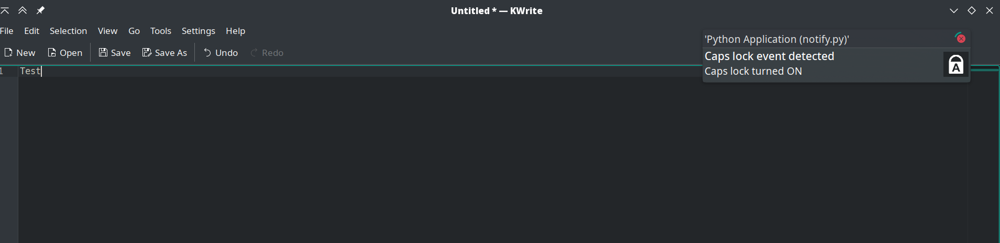
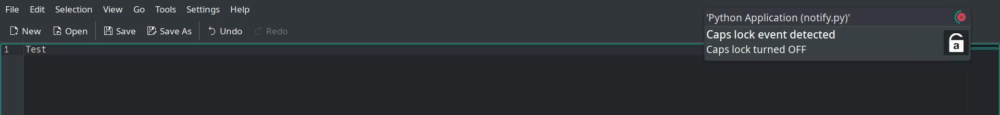

# CAPSNUM

My computer doesn't have a way to see the current status of **Lock  keys (Caps lock and Num lock)** so I decided to build this python script to do the job.

**TESTED ONLY IN LINUX** 

## How to install and run  

First, make sure  that you have a running python venv and set the  path to it as a value of the variable `pythonPath` in the **Makefile** .
To set up and run, you can use `make install && make run` that will install all required dependencies and run the script. Or you can install the dependencies `pynput and notify-py` by your self then run the script using python.


## Screenshots
  




## Known bugs/limitations

This script uses a threading.Thread listener to listen for keyboard events, and it should not be used as a keylogger.

## Extra

Create a job to automatically run the script at startup with systemd.
Create a file `sudo touch /etc/systemd/system/lockkey_status.service` and add the following lines :

```
[Unit]
Description=Track lock key(caps lock and num lock) status using python
After=multi-user.target

[Service]
Type=simple
ExecStart=/path/to/python/venv /path/to/script.py
WantedBy=multi-user.target

[Install]
WantedBy=default.target

```

Then run the following commands : `systemctl --user daemon-reload && systemctl --user start lockey_status.service && systemctl --user enable lockey_status.service`

